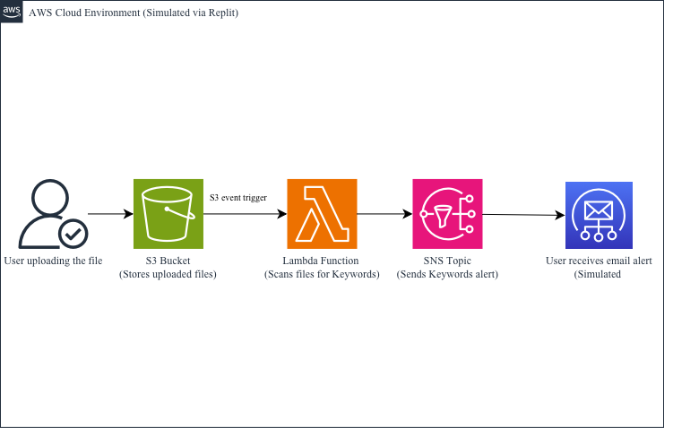

## Serverless Event-Driven Notification System (Simulated AWS)
This project simulates a serverless notification system designed to be deployed on AWS using services like S3, Lambda, and SNS. For prototyping, the logic was implemented on Replit, simulating cloud workflows.
An AWS account is not required. This is ideal for cloud beginners!

Many organizations want real-time alerts when sensitive or important content is uploaded (e.g. "urgent", "alert", "breaking"). This system scans uploaded files and notifies users instantly when key terms are detected.
This project aims to demonstrate understanding of:
- S3 file upload triggers
- Lambda function processing
- SNS-style notifications

## How It Works
1. A file (e.g. `urgent_report.txt`) is "uploaded" to a folder (simulating S3)
2. A Python script simulates AWS Lambda
3. If keywords like `urgent`, `breaking`, or `alert` are found, a simulated notification is printed

## Tools used
- Python
- Replit
- GitHub
- Draw.io

## Folder Structure
aws-serverless-keyword-alert/
├── sample_files/
│   └── urgent_report.txt
├── lambda_simulation/
│   └── handler.py
├── s3_upload_simulation.py
└── README.md

## Architecture

## Skills Demonstrated
- Event-driven architecture
- Serverless design
- AWS simulation without real cloud usage

## 👩‍💻 About Me
I'm Michelle. This project is part of my learning journey in cloud computing and showcases my understanding of event-driven serverless systems, even in non-AWS environments.

